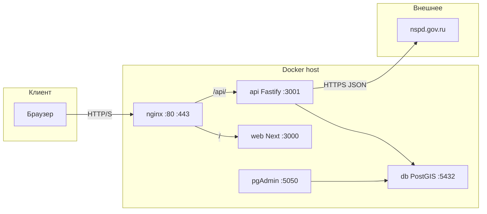

# GeoRisk — лендинг + API + PostGIS

Маркетинговый одностраничник: кадастровый ввод → НСПД, карты (десктоп и мобилка), блоки «что проверяем», пример отчёта, тарифы, заявки в БД.

**Стек:** Next.js 15 (App Router), React 18, TypeScript, Tailwind · Node 20 (Fastify) · PostgreSQL/PostGIS · Docker Compose · nginx.

---

## Для новой машины и для ИИ-ассистента

Прочитай этот файл **сверху вниз** один раз — дальше не нужно угадывать контекст чата.

1. **Прод** почти всегда: репозиторий на VPS → **`.env`** из **`.env.example`** → **`docker compose up -d --build`**. Снаружи: **nginx :80** (и **:443** после Let’s Encrypt, см. ниже).
2. **API не в Next:** браузер бьёт в **`/api/*`** на том же хосте; nginx проксирует в контейнер **`api`**. Локальный **`npm run dev`** без прокси **не увидит** кадастр — только полный Compose или ручной прокси на порт API.
3. **НСПД** (`nspd.gov.ru`): запросы только из **`api`**, с «браузерными» заголовками; часто **403** без них или с датацентрового IP → см. раздел **НСПД** и **`NSPD_*`** в `.env`.
4. **HTTPS:** до выпуска сертификата открывай **`http://`**. Не подключай **`docker-compose.ssl.yml`**, пока в томе **`certbot_conf`** нет `live/<домен>/fullchain.pem` — иначе nginx не стартует.
5. **Две карты:** десктоп — секция **`#desktop-map-section`**, узкий экран — **`#mobile-map-section`** (в Hero на мобилке ссылка «на карте» ведёт туда).

---

## Быстрый старт (VPS / прод)

```bash
git clone <repo-url> && cd georisk
cp .env.example .env
# Заполни POSTGRES_DB, POSTGRES_USER, POSTGRES_PASSWORD (и при необходимости NSPD_*, PGADMIN_*, Umami).
docker compose up -d --build
docker compose ps
```

Проверки с ВМ:

```bash
curl -I http://127.0.0.1/
curl -sS "http://127.0.0.1/api/cadastre/38:06:144003:4723" | head
```

В облаке: **security group** — входящие **TCP 80** (минимум), после SSL — **TCP 443**. Публичный IPv4 именно этой ВМ.

### Прод **geo-risk.ru** и контейнеры: не путать с dev

Публичный сайт (домен → nginx **:80** / **:443**) обслуживают **продовые** сервисы из [`docker-compose.yml`](docker-compose.yml): **`web`** (Next) и **`api`** (Fastify). Именно их нужно пересобирать после `git pull`, чтобы изменения попали на прод.

**`web-dev`** ([`docker-compose.dev.yml`](docker-compose.dev.yml), порт **:3002**) — отдельный контейнер для проверки фронта на том же сервере; на публичный домен он **не** влияет. «Выкатить как на проде» = обновить код в клоне репозитория и выполнить, например:

```bash
cd georisk
git fetch origin
# Выбери ту ветку, которую реально трекаешь на этом сервере для прода (часто main или feature):
git checkout main    # или: git checkout feature
git pull origin main   # или: git pull origin feature
docker compose build web api && docker compose up -d web api
```

Так ты переносишь изменения **в продовые** образы `web` / `api`; **`db`** и **`nginx`** трогать не обязательно, если не менялся compose и схема БД.

---

## Переезд на новый сервер (чеклист)

Если текущая ВМ тормозит (HDD, мало RAM/CPU), безопасный путь — поднять новый VPS и переключить DNS.

1. На старом сервере сохрани БД в дамп:

```bash
cd georisk
set -a && source .env && set +a
# Полный SQL-дамп может быть очень большим. Для быстрого переезда используем core-дамп:
docker compose exec -T db pg_dump -U "$POSTGRES_USER" -d "$POSTGRES_DB" -Fc -Z 9 -T public.landuse_areas -T public.oopt_areas > backups/postgres-core.dump
```

2. На новом сервере:

```bash
git clone <repo-url> && cd georisk
git checkout feature   # или нужная ветка релиза
cp .env.example .env   # заполнить переменные как на старом сервере
docker compose up -d --build
```

3. Восстанови БД:

```bash
set -a && source .env && set +a
docker compose exec -T db pg_restore -U "$POSTGRES_USER" -d "$POSTGRES_DB" --clean --if-exists < backups/postgres-core.dump
```

4. Если был HTTPS через certbot:
   - либо заново выпусти сертификат (раздел ниже),
   - либо перенеси том `certbot_conf` со старого сервера.

5. Проверь:
   - `curl -I http://127.0.0.1/`
   - `docker compose ps`
   - запросы в pgAdmin / `SELECT COUNT(*) ...`

6. Только после проверки переведи DNS A-запись домена на новый IP.

Важно: данные Postgres **не переносятся автоматически** с `git clone`. Репозиторий переносит код/скрипты, а БД живёт в docker volume (`pg_data`), поэтому нужен `pg_dump/psql` (или перенос volume на уровне Docker/файловой системы).

Дополнительно: можно хранить core-дамп прямо в репозитории в папке **[`backups/`](backups/)** и вытягивать его на новый сервер через `git pull`. Детали — в **[`backups/README.md`](backups/README.md)**.

---

## Быстрый старт (только фронт на ноутбуке)

```bash
npm install
npm run dev
```

**Ограничение:** запросы вида **`/api/cadastre/...`** пойдут на `localhost:3000` — у Next **нет** этого маршрута → ошибка/пусто. Для кадастра и лидов подними **полный Docker Compose** или настрой reverse-proxy **`/api` → `localhost:3001`**.

---

## Dev-контур без трогания прода

Для быстрых правок фронта подними только отдельный `web-dev`, не перезапуская продовые `web/nginx`.

```bash
# запуск dev-фронта (использует текущие api/db из docker-compose.yml)
docker compose -f docker-compose.yml -f docker-compose.dev.yml up -d web-dev

# смотреть логи
docker compose -f docker-compose.yml -f docker-compose.dev.yml logs -f web-dev

# остановить только dev-фронт
docker compose -f docker-compose.yml -f docker-compose.dev.yml stop web-dev
```

Открывай dev-версию на **`http://127.0.0.1:3002`** (или **`http://<IP-сервера>:3002`**, если браузер не на той же машине, где Docker). Сайт на **`http://localhost/`** (порт **80**) — это **nginx → продовый `web`**, не dev-фронт; порт **3000** на хост **не проброшен** (у `web` только `expose`), поэтому **`http://localhost:3000`** даст **connection refused** — это ожидаемо.

Если работаешь через SSH с ноутбука: `ssh -L 3002:127.0.0.1:3002 user@сервер` и на ноутбуке открывай **`http://127.0.0.1:3002`**.

Кэш Next для dev лежит в томе **`web_dev_next`** (`/app/.next` в контейнере), а не в каталоге на хосте — так не ломается `next dev` после `next build` на машине (ошибки вида **`Cannot find module './NNN.js'`**). Если кэш всё же испортился: останови `web-dev`, выполни `docker volume rm georisk_web_dev_next` (имя тома см. `docker volume ls | grep next`) и снова `up -d web-dev`.

### Временная блокировка кнопки «Скачать отчет»

На странице [`app/risk-map/page.tsx`](app/risk-map/page.tsx) есть флаг:

`const REPORT_DOWNLOAD_BUTTON_DISABLED = true;`

При `true` кнопка «Скачать отчет» остается в UI, но некликабельна (логика построения отчета и polling статуса остаются в коде).
Чтобы вернуть кликабельность, поменяй флаг на `false`.

---

## Сервисы Docker Compose

| Сервис | Образ / сборка | Роль |
|--------|------------------|------|
| **nginx** | `nginx:1.27-alpine` | **:80** всегда; **:443** при подключении **[`docker-compose.ssl.yml`](docker-compose.ssl.yml)** (или **`COMPOSE_FILE`** в `.env`). Прокси **`/` → web:3000**, **`/api/` → api:3001**. ACME: **`/.well-known/acme-challenge/`** → том **`certbot_www`**. Конфиг: **[`infra/nginx/default.conf`](infra/nginx/default.conf)**. |
| **web** | корневой [`Dockerfile`](Dockerfile) | Next SSR/статика. |
| **api** | [`backend/Dockerfile`](backend/Dockerfile) | Fastify: `/health`, `/api/cadastre/:code`, POST `/api/cadastre/by-polygon`, POST `/api/risk-map/overlays`, POST `/api/terrain/nasadem` (NASADEM через Earth Engine, см. ниже), POST `/api/leads`. |
| **db** | `postgis/postgis:16-3.4` | PostGIS, таблицы заявок, кэш кадастра, слой **ООПТ** и т.д. |
| **pgadmin** | `dpage/pgadmin4` | UI БД на **`127.0.0.1:5050`** (не торчит наружу по умолчанию). |
| **certbot** | `certbot/certbot` (профиль **`certbot`**) | Ручной выпуск/renew сертификатов, тома **`certbot_www`**, **`certbot_conf`**. |

---

## Google Earth Engine (NASADEM: уклон и высота)

Интерактивный вход Colab (`auth.authenticate_user()`) **на сервере не используется**. Вместо этого — **сервисный аккаунт** Google Cloud и JSON-ключ в контейнере.

1. В [Google Cloud Console](https://console.cloud.google.com/) выбери или создай проект; в [Earth Engine Code Editor](https://code.earthengine.google.com/) привяжи проект к EE (регистрация Earth Engine для облака).
2. **IAM → Service Accounts →** создать аккаунт → **Keys → Add key → JSON**. Положи копию как **`secrets/google-earth-engine-sa.json`** в корне репозитория (каталог **`secrets/*.json`** в **`.gitignore`**, в git не попадёт).
3. Включи для проекта API **Google Earth Engine** (и при необходимости стандартные API для сервисного аккаунта).
4. **IAM →** для **того же** сервисного аккаунта (`client_email` в JSON), на уровне проекта добавь роли:
   - **`Service Usage Consumer`** (`roles/serviceusage.serviceUsageConsumer`) — иначе *serviceusage.services.use*;
   - **`Earth Engine Resource Writer`** (`roles/earthengine.writer`) — иначе *earthengine.computations.create denied* при расчётах (`reduceRegion` / `getInfo`).
   Распространение IAM обычно 1–3 минуты.
5. В **`.env`** задай **`GEE_PROJECT_ID`** (= поле `project_id` в JSON). Путь к ключу в контейнере по умолчанию **`GOOGLE_APPLICATION_CREDENTIALS=/run/secrets/gee_sa.json`** — в **[`docker-compose.yml`](docker-compose.yml)** у сервиса **`api`** уже смонтировано `./secrets/google-earth-engine-sa.json` → `/run/secrets/gee_sa.json`.
6. Пересобери и подними **`api`**: `docker compose build api && docker compose up -d api`. Python и `earthengine-api` ставятся в образ (`/opt/ee-venv`).

**POST `/api/terrain/nasadem`** — тело JSON:

- **`{ "cadastreFeature": { "type": "Feature", "geometry": { "type": "Polygon", "coordinates": [[[lon,lat],...]] } } }`** — как у карты рисков; или  
- **`{ "ring": [[lat,lng], ...] }`** — то же кольцо, что для POST `/api/cadastre/by-polygon` (широта, долгота).

Ответ **`200`**: `{ "maxSlopeDeg": number|null, "elevationM": number|null, "source": "NASA/NASADEM_HGT/001", "scaleMeters": 30 }`. Высота — **NASADEM в центроиде участка** (один пиксель ~30 м), максимальный уклон — **по всему полигону** в пределах участка. Если EE не настроен — **`503`** с кодом `GEE_NOT_CONFIGURED`.

---

## Переменные окружения

Файл **`.env`** в git **не коммитится** — копируй с **[`.env.example`](.env.example)**.

| Переменная | Обязательно | Смысл |
|------------|-------------|--------|
| `POSTGRES_*` | да для Compose | БД для `db` и `api`. |
| `GEE_PROJECT_ID` | нет | GCP project id для Earth Engine; без него POST `/api/terrain/nasadem` → 503. |
| `GOOGLE_APPLICATION_CREDENTIALS` | нет | Путь к JSON сервисного аккаунта **внутри контейнера** `api`. |
| `COMPOSE_FILE` | нет | После настройки HTTPS: **`docker-compose.yml:docker-compose.ssl.yml`**, чтобы одна команда **`docker compose up`** поднимала и **443**. |
| `NEXT_PUBLIC_API_BASE_URL` | нет | Обычно **пусто** — относительные **`/api/...`**. |
| `GEORISK_UMAMI_SCRIPT_URL` | нет | По умолчанию **`https://cloud.umami.is/script.js`**. |
| `GEORISK_UMAMI_WEBSITE_ID` | да для трекинга в Docker | UUID сайта из Umami Cloud → **build** образа **web**. |
| `GEORISK_PUBLIC_SITE_URL` | нет | Для **`NEXT_PUBLIC_API_BASE_URL`** в билде; иначе **`https://${DOMAIN}`**. |
| `NEXT_PUBLIC_UMAMI_*` | нет | Дубли для **runtime** (`env_file`); на билд не влияют, если пусты в shell — см. **`GEORISK_***`. |
| `NSPD_TLS_INSECURE` | нет | `true` — ослабить проверку TLS **только** для исходящих запросов API к НСПД (корпоративный MITM и т.п.). |
| `NODE_EXTRA_CA_CERTS` | нет | PEM доверенных CA **внутри контейнера api** (предпочтительнее, чем только `NSPD_TLS_INSECURE`). |
| `NSPD_HTTPS_PROXY` / `NSPD_HTTP_PROXY` | нет | Прокси **только** для запросов к `nspd.gov.ru` (обход блокировок по IP датацентра). |
| `PGADMIN_DEFAULT_*` | нет | Логин в pgAdmin (в Compose есть дефолты). |
| `DOMAIN` | нет | Памятка для человека/доков; на nginx не влияет. |

---

## Подводные камни (чеклист)

| Проблема | Что делать |
|----------|------------|
| Сайт по **домену** не открывается, по **IP** открывается | DNS **A** на верный IP; пробовать **`http://`**; до certbot нет **443**. |
| **`docker-compose.ssl.yml`** подключили раньше сертификата | Nginx падает: нет **`fullchain.pem`**. Сначала **`certonly --webroot`**, потом overlay. |
| Кадастр **403 / NSPD_BLOCKED** | Заголовки в `server.js`; прокси **`NSPD_HTTPS_PROXY`**; не обязательно «бан IP». |
| Кадастр **503 / NSPD_TLS** | **`NSPD_TLS_INSECURE=true`** или **`NODE_EXTRA_CA_CERTS`**. |
| **`permission denied`** на Docker | `sudo usermod -aG docker $USER`, новый SSH-сеанс. |
| Снаружи не видно сайта | Security group: **80**/**443**; у nginx в `ps` — `0.0.0.0:80->80/tcp`. |
| pgAdmin не открыть удалённо | Порт **5050** привязан к **127.0.0.1** — только с ВМ или SSH-туннель. |
| Импорт ООПТ: в git нет `.shp` | В **`.gitignore`** крупные shapefile; кладёшь файлы локально, см. **[`data/oopt/README.md`](data/oopt/README.md)**, скрипт **[`scripts/import_oopt.sh`](scripts/import_oopt.sh)**. |
| **React Strict Mode** в dev | Двойные эффекты — норма; прод-сборка без этого. |
| **Umami / аналитика в Docker** | Счётчик вшивается при **`npm run build`**. В **[`docker-compose.yml`](docker-compose.yml)** для build используются **`GEORISK_UMAMI_*`** и **`GEORISK_PUBLIC_SITE_URL`**, а не `NEXT_PUBLIC_*`: в shell Cursor часто висят **пустые** `NEXT_PUBLIC_*`, и Compose подставляет их вместо значений из `.env`. Задай **`GEORISK_UMAMI_WEBSITE_ID`** в `.env`, пересобери **`docker compose build --no-cache web`**. |

---

## HTTPS (Let’s Encrypt)

1. DNS **A** на IP ВМ: apex и при необходимости **`www`**.
2. **`docker compose up -d --build`** (HTTP уже отдаёт **`.well-known`**).
3. Выпуск сертификата (подставь email):

```bash
docker compose --profile certbot run --rm certbot certonly \
  --webroot -w /var/www/certbot \
  -d geo-risk.ru -d www.geo-risk.ru \
  --email you@example.com --agree-tos --no-eff-email
```

4. Открыть **TCP 443** в firewall, затем:

```bash
docker compose -f docker-compose.yml -f docker-compose.ssl.yml up -d
```

5. В **`.env`**: **`COMPOSE_FILE=docker-compose.yml:docker-compose.ssl.yml`**, чтобы дальше хватало **`docker compose up -d`**.

Пути в **[`infra/nginx/https.conf`](infra/nginx/https.conf)** — **`/etc/letsencrypt/live/geo-risk.ru/`** (первый **`-d`** в certbot). Опционально заменить HTTP-конфиг на редирект-only: **[`infra/nginx/default-http-redirect-to-https.conf`](infra/nginx/default-http-redirect-to-https.conf)**.

Продление: **[`scripts/renew-ssl.sh`](scripts/renew-ssl.sh)** из cron (раз в несколько дней достаточно).

**Домен / `server_name`:** раньше использовался catch-all **`_`** — с одним `server` на **:80** это не ломало домен; типичная путаница — ожидание **HTTPS** без настройки TLS. Сейчас в **`default.conf`** явно **`geo-risk.ru`**, **`www`**, **`default_server`** на apex (запрос по IP тоже попадает в сайт).

---

## Архитектура



---

## НСПД и кадастр (backend)

Файл: **[`backend/src/server.js`](backend/src/server.js)**.

- **GET** `https://nspd.gov.ru/api/geoportal/v2/search/geoportal?thematicSearchId=1&query=<код>&CRS=EPSG:4326`
- Заголовки **`NSPD_GEOSEARCH_HEADERS`** (User-Agent, Referer, Accept-Language).
- Кэш ответа в **`cadastre_cache`** (~24 ч).
- Старт: **`waitForPoolReady()`** перед миграциями схемы.

Коды ошибок на фронте: **`NSPD_BLOCKED`**, **`NSPD_TLS`**, **502**.

---

## Заявки и БД

- **`POST /api/leads`** → **`lead_submissions`**; view **`applications`** (то же для удобства в SQL/pgAdmin).
- Проверка: см. блоки `docker compose exec db psql ...` ниже.

---

## Docker Compose: команды отладки

```bash
docker compose logs -f api
docker compose exec db psql -U "$POSTGRES_USER" -d "$POSTGRES_DB" -c "SELECT id, name, phone, created_at FROM applications ORDER BY id DESC LIMIT 5;"
docker compose exec db psql -U "$POSTGRES_USER" -d "$POSTGRES_DB" -c "SELECT code, expires_at FROM cadastre_cache ORDER BY created_at DESC LIMIT 5;"
```

---

## pgAdmin

**`http://127.0.0.1:5050`** — учётка из **`PGADMIN_DEFAULT_*`**. Сервер в UI: host **`db`**, порт **5432**, БД/пользователь как в **`POSTGRES_*`**.

---

## Требования

- **Node.js 20 LTS** (или 18.18+) — локальная сборка и образ **web** / **api**.
- **npm**.
- **Docker + Compose plugin** — деплой как в репозитории.

---

## Локальная разработка (npm)

```bash
npm install
npm run build
npm run start   # после build
npm run lint
```

См. **`package.json`**: `dev`, `sync-report-slides` и др.

---

## Структура репозитория

| Путь | Назначение |
|------|------------|
| [`app/page.tsx`](app/page.tsx) | Главная: кадастр, полигон, карты, лиды. Скролл к картам: **`#desktop-map-section`** / **`#mobile-map-section`**. |
| [`app/layout.tsx`](app/layout.tsx) | Layout, метаданные. |
| [`app/globals.css`](app/globals.css) | Tailwind, **`scroll-padding-top`**. |
| [`components/Hero.tsx`](components/Hero.tsx) | Ввод кадастра; на мобилке ссылка на **`#mobile-map-section`**. |
| [`components/MapSection.tsx`](components/MapSection.tsx) | Десктоп-карта, **`id="desktop-map-section"`**. |
| [`components/MobileMapSection.tsx`](components/MobileMapSection.tsx) | Мобильная карта, **`id="mobile-map-section"`**, скролл к CTA после успешного кадастра. |
| [`components/CadastreInfoPanel.tsx`](components/CadastreInfoPanel.tsx) | «Данные участка», кнопка «Проверить риски…». |
| [`components/LeadForm.tsx`](components/LeadForm.tsx) | **`POST /api/leads`**. |
| [`lib/cadastre.ts`](lib/cadastre.ts) | Типы ответов API. |
| [`lib/contact.ts`](lib/contact.ts) | Телефон, Telegram. |
| [`backend/src/server.js`](backend/src/server.js) | Fastify, схема БД, НСПД, лиды. |
| [`docker-compose.yml`](docker-compose.yml) | Полный стек. |
| [`docker-compose.ssl.yml`](docker-compose.ssl.yml) | Опционально: **443** + **`https.conf`**. |
| [`infra/nginx/`](infra/nginx/) | nginx, ACME, HTTPS. |
| [`scripts/import_oopt.sh`](scripts/import_oopt.sh), [`data/oopt/README.md`](data/oopt/README.md) | Импорт слоя ООПТ. |

---

## Главная страница (логика UI)

- **`"use client"`** — карты и формы на клиенте.
- Порядок секций в **`main`** через Tailwind **`order`**: **Hero** → **MapSection** (виден с **`md`**, на телефоне скрыт) → **SolutionsMistakesSection** → **MobileMapSection** (только до **`md`**) → **WhatWeCheck** → **ReportExample** → панель с **LeadForm** + **Pricing** → **Footer**.
- Состояние **`cadastreData`** / **`polygonCoords`**: см. [`app/page.tsx`](app/page.tsx); после успешного ввода кадастра в Hero вызывается скролл к блоку карты (разный якорь для mobile/desktop).
- Модалка контактов: **`ContactAdminModalProvider`** + **`useContactAdminModal()`**.

---

## Контент и ассеты

- Контакты: **[`lib/contact.ts`](lib/contact.ts)**.
- Слайды отчёта: **`public/report-slide-*.png`**; синхронизация из PPTX — **`npm run sync-report-slides`**.

---

## Скрипты npm

| Скрипт | Действие |
|--------|----------|
| `dev` | Dev-сервер Next |
| `build` / `start` | Продакшен |
| `lint` | ESLint |
| `sync-report-slides` | PPTX → PNG в `public/` |

---

## Дальнейшая гео-логика

В БД уже есть геоданные заявок и слои вроде **ООПТ**; можно наращивать **`ST_Intersects`**, отчёты, отдельные воркеры.

---

## YooKassa: поля анкеты

Для подключения платежей на сайт в анкете YooKassa можно использовать:

- Адрес сайта: **`https://geo-risk.ru`**
- Ссылка на страницу с реквизитами: **`https://geo-risk.ru/requisites`**
- Ссылка на условия оказания услуг (оферта): **`https://geo-risk.ru/offer`**
