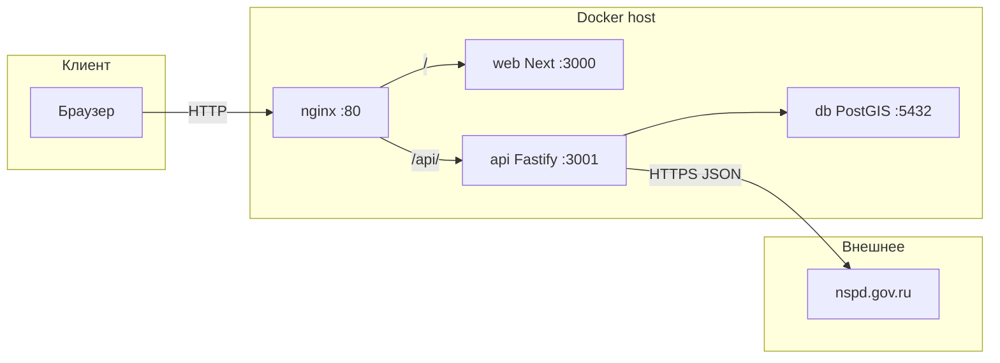

# GeoRisk — лендинг + API + PostGIS

Одностраничный маркетинговый сайт (MVP) сервиса проверки георисков участка: кадастровый ввод, запрос к НСПД, карты, блоки «что проверяем», пример отчёта, тарифы, форма заявки. Стек фронта — **Next.js 15 (App Router)**, **React 18**, **TypeScript**, **Tailwind CSS**. Бэкенд — **Node.js (Fastify)** + **PostgreSQL/PostGIS** в **Docker Compose**, снаружи — **nginx** на порту **80**.

---

## Зачем этот README (контекст без истории чата)

Если репозиторий открыт на **новой машине** или ассистенту нужно быстро войти в контекст:

1. **Продакшен** почти всегда = `docker compose up -d --build`. Пользователь ходит на **`http://<публичный_IP>/`**. Запросы **`/api/*`** nginx проксирует в контейнер **`api`**, остальное — в **`web`** (Next).
2. **Кадастр** не запрашивается из браузера напрямую в НСПД: фронт вызывает **`GET /api/cadastre/:code`**, ответ кэшируется в БД **24 ч**.
3. **Заявки** с формы: **`POST /api/leads`** → таблица **`lead_submissions`** (имя, телефон, опционально полигон WKT/geom, кадастр, JSON объекта).
4. Критичные места кода: **[`app/page.tsx`](app/page.tsx)** (состояние кадастра и полигона), **[`backend/src/server.js`](backend/src/server.js)** (НСПД, схема БД, лиды), **[`infra/nginx/default.conf`](infra/nginx/default.conf)** (маршрутизация), **[`.env.example`](.env.example)** (шаблон переменных).
5. **`DOMAIN`** в `.env` — в основном для документации/будущего; фронт по умолчанию бьёт в **относительный** `/api/...`. Важнее **публичный IPv4 ВМ** в облачной консоли и **открытый TCP 80** в security group.

---

## Архитектура (кратко)



| Сервис (`docker-compose`) | Образ / сборка | Роль |
|---------------------------|------------------|------|
| **nginx** | `nginx:1.27-alpine` | Порт **80** на хосте; `location /api/` → **api**; `/` → **web**; кэш заголовков для `/_next/static/`. |
| **web** | `Dockerfile` (Next) | SSR/статика лендинга. |
| **api** | `backend/Dockerfile` (Node 20) | Fastify: `/health`, `/api/cadastre/:code`, `/api/leads`. Исходящие запросы к НСПД только отсюда. |
| **db** | `postgis/postgis:16-3.4` | Таблицы `lead_submissions`, `cadastre_cache`; расширение `postgis`. |

---

## Переменные окружения

Скопируй **[`.env.example`](.env.example)** → **`.env`** (файл `.env` в git не коммитится).

| Переменная | Обязательно | Смысл |
|------------|-------------|--------|
| `POSTGRES_DB`, `POSTGRES_USER`, `POSTGRES_PASSWORD` | да для Compose | Учётка БД для `db` и `api`. |
| `NEXT_PUBLIC_API_BASE_URL` | нет | Обычно **пусто**: браузер дергает тот же хост `/api/...` через nginx. |
| `NEXT_PUBLIC_UMAMI_*` | нет | Аналитика Umami Cloud. |
| `NSPD_TLS_INSECURE` | нет | `true` — если TLS к НСПД падает (корпоративный MITM, цепочка сертификатов). Только для исходящего запроса в коде API. |
| `NODE_EXTRA_CA_CERTS` | нет | Путь к PEM доверенных CA **внутри контейнера** api (предпочтительнее, чем отключать TLS). |
| `NSPD_HTTPS_PROXY` / `NSPD_HTTP_PROXY` | нет | HTTP(S)-прокси **только** для запросов к `nspd.gov.ru` (например второй VPS с «бытовым» IP), если датацентр режут по IP. |
| `DOMAIN` | нет | Подсказка своего домена/IP для доков; на маршрутизацию nginx не влияет. |

---

## НСПД и кадастр (backend)

Файл: **[`backend/src/server.js`](backend/src/server.js)**.

- **URL:** `GET https://nspd.gov.ru/api/geoportal/v2/search/geoportal?thematicSearchId=1&query=<код>&CRS=EPSG:4326` (как у публичной карты).
- **Заголовки:** к запросу к НСПД добавлены **браузероподобные** `User-Agent`, `Referer`, `Accept-Language` (`NSPD_GEOSEARCH_HEADERS`). Без них НСПД часто отвечает **403**, хотя с того же IP **Python** (`nspd-request`) или **curl** с заголовками могут работать — это **не обязательно** «блокировка IP», а WAF/антибот.
- **TLS:** при ошибках сертификата API отдаёт **503** с кодом `NSPD_TLS` — см. `NSPD_TLS_INSECURE` / `NODE_EXTRA_CA_CERTS` в `.env`.
- **Кэш:** успешный ответ пишется в **`cadastre_cache`** на **24 часа** (`expires_at`).
- **Старт API:** перед миграциями схемы вызывается **`waitForPoolReady()`** — несколько попыток `SELECT 1`, чтобы не падать с `ECONNREFUSED` при первом `compose up` (гонка с `depends_on: healthy` у Postgres).

Ошибки API для фронта (кадастр): **`NSPD_BLOCKED`** (403/401/429 от НСПД), **`NSPD_TLS`**, общий апстрим **502**.

---

## Docker Compose: запуск и типичные проблемы

```bash
cp .env.example .env   # заполнить POSTGRES_*
docker compose up -d --build
docker compose ps
```

Проверки:

```bash
curl -sS "http://127.0.0.1/api/cadastre/38:06:144003:4723" | head
curl -I http://127.0.0.1/
docker compose logs -f api
```

| Симптом | Что проверить |
|---------|----------------|
| `permission denied` на `docker.sock` | `sudo usermod -aG docker $USER`, затем **новый SSH-сеанс** или `newgrp docker`. |
| Сайт не открывается извне | В консоли облака: **правильный публичный IPv4** именно этой ВМ (`curl -4 ifconfig.me` **с ВМ**), **security group**: входящий **TCP 80**. У `nginx` в `docker compose ps` должно быть `0.0.0.0:80->80/tcp`. |
| Лендинг есть, кадастр **502/503** | Логи `api`; НСПД: заголовки (см. выше), TLS, прокси. |
| `npm run dev` локально без Docker | Фронт дергает **`/api/cadastre/...`** на том же origin — **маршрута Next нет**, ответа не будет, пока не поднят полный стек или не настроен reverse-proxy/rewrite на порт API. Для полной проверки кадастра/лидов используй **Compose** или проксируй `/api` на `localhost:3001`. |

Заявки в БД:

```bash
docker compose exec db psql -U "$POSTGRES_USER" -d "$POSTGRES_DB" -c "SELECT id, name, phone, created_at FROM lead_submissions ORDER BY id DESC LIMIT 10;"
```

Кэш кадастра:

```bash
docker compose exec db psql -U "$POSTGRES_USER" -d "$POSTGRES_DB" -c "SELECT code, expires_at FROM cadastre_cache ORDER BY created_at DESC LIMIT 10;"
```

---

## Требования

- **Node.js 18.18+** (рекомендуется **20 LTS**) для локальной сборки фронта и для образа API.
- **npm**.
- **Docker + Docker Compose plugin** для деплоя как в репозитории.

---

## Локальная разработка (только Next)

```bash
npm install
npm run dev
```

Сборка и прод без контейнера:

```bash
npm run build
npm run start
```

Линт: `npm run lint`.

---

## Структура репозитория

| Путь | Назначение |
|------|------------|
| [`app/layout.tsx`](app/layout.tsx) | Корневой layout, метаданные, `globals.css`. |
| [`app/page.tsx`](app/page.tsx) | Главная: `polygonCoords`, `cadastreData`, `handleCadastreCaptured` → `fetch('/api/cadastre/...')`, передача feature/summary в карты и **LeadForm**. |
| [`app/globals.css`](app/globals.css) | Глобальные стили, Tailwind. |
| [`components/`](components/) | UI: Hero, карты, форма, модалка контактов, тарифы и т.д. |
| [`lib/contact.ts`](lib/contact.ts) | Телефон и Telegram для шапки и модалки. |
| [`lib/cadastre.ts`](lib/cadastre.ts) | Типы ответа `GET /api/cadastre/:code` для фронта. |
| [`public/`](public/) | Статика, слайды отчёта `report-slide-*.png`. |
| [`scripts/sync-report-carousel-from-pptx.sh`](scripts/sync-report-carousel-from-pptx.sh) | Опционально: PPTX → PNG в `public/`. |
| [`tailwind.config.ts`](tailwind.config.ts) | Тема (`mint`, `geoblue`, …). |
| [`next.config.mjs`](next.config.mjs) | Конфиг Next (`reactStrictMode`). |
| [`Dockerfile`](Dockerfile) | Сборка образа **web**. |
| [`docker-compose.yml`](docker-compose.yml) | **web**, **api**, **db**, **nginx**. |
| [`infra/nginx/default.conf`](infra/nginx/default.conf) | Прокси на **web:3000** и **api:3001**. |
| [`backend/`](backend/) | Fastify API, `src/server.js`. |
| [`.env.example`](.env.example) | Шаблон переменных. |

---

## Как устроена главная страница

Страница **`"use client"`**: карты Leaflet, модалка, формы на клиенте.

### Модалка контактов

[`ContactAdminModalProvider`](components/ContactAdminModal.tsx) — хук `useContactAdminModal()`, `openContactModal()`.

### Состояние

В [`app/page.tsx`](app/page.tsx):

- **`polygonCoords`** — с [`MapSection`](components/MapSection.tsx) / [`MobileMapSection`](components/MobileMapSection.tsx).
- **`cadastreData`** — после ввода кадастра в **Hero** и успешного **`GET /api/cadastre/:code`**; передаётся в карты (**подсветка объекта**, панель сводки) и в [**LeadForm**](components/LeadForm.tsx) (`cadastreNumber`, `cadastreFeature`, `polygonCoords` уходят в **`POST /api/leads`**).

### Порядок секций и карты

Секции в `main` с **`order`** для адаптива. Поток: **Hero** → **MapSection** (десктоп, `md+`, Leaflet + leaflet-draw) → **SolutionsMistakesSection** → **MobileMapSection** (≤768px, Leaflet + leaflet-geoman-free) → **WhatWeCheck** → **ReportExample** → **EndSemrushPanel** (**LeadForm** + **Pricing**) → **Footer**.

**Navbar:** [`components/Navbar.tsx`](components/Navbar.tsx) — контакты из [`lib/contact.ts`](lib/contact.ts).

---

## Контент и ассеты

- Контакты: **[`lib/contact.ts`](lib/contact.ts)**.
- Логотип: **`/logo-mark.png`**.
- Карусель отчёта: **`/report-slide-1.png` … `5.png`**; пересборка из **`отчет.pptx`**: `npm run sync-report-slides` (см. скрипт в `scripts/`).

---

## Деплой (облако / VPS)

Установка Docker (пример для Ubuntu) — см. официальную документацию Docker CE + **compose plugin**.

На сервере:

```bash
cp .env.example .env
# задать POSTGRES_*; при необходимости NSPD_* и Umami
docker compose up -d --build
```

Проверка кадастра снаружи:

```bash
curl "http://<SERVER_IP>/api/cadastre/38:06:144003:4723"
```

**HTTPS:** в compose nginx слушает **80**. TLS — на балансировщике, **certbot** на хосте с прокси на 80, или отдельный конфиг **443** в nginx.

---

## Скрипты npm

| Скрипт | Действие |
|--------|----------|
| `dev` | Dev-сервер Next |
| `build` | Продакшен-сборка |
| `start` | Запуск после `build` |
| `lint` | ESLint |
| `sync-report-slides` | PPTX → PNG в `public/` |

---

## Подготовка к будущей гео-логике

Backend уже пишет заявки в PostGIS; можно добавлять spatial-слои, `ST_Intersects`, генерацию отчётов, отдельные сервисы.
